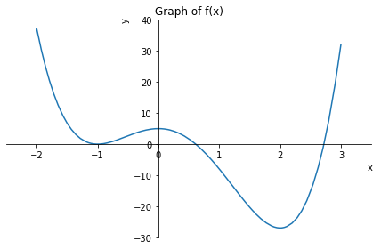
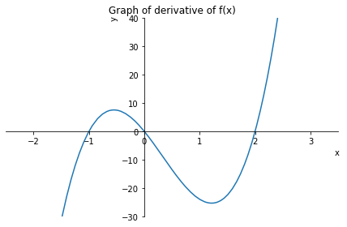
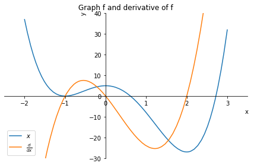

# <span style='color:red'> Derivative Test </span> 


***

## What Does $f'$ Say about $f$ ?

We can see how the derivative of f can tell us where a function is increasing or decreasing.

***


### <span style='color:orange'> Increasing/Decreasing Test </span>

(a) If $f'$(x) > 0 on an interval, then $f$ is increasing on that interval.

(b) If $f'$(x) > 0 on an interval, then $f$ is increasing on that interval.

####  <span style='color:green'> EXAMPLE</span>

 Find where the function $f$(x) = 3x$^4$ - 4x$^3$ - 12x$^2$ + 5 is increasing 
and where it is decreasing.


```python
# importing the required module
import sympy as sym
import sympy.plotting.plot  as symplot
from IPython.display import display,Math
```


```python
# for symbolic computations, the symbol is assigned to a variable
x = sym.symbols('x')
# our function is defined below
fx = 3*x**4  - 4*x**3  - 12*x**2  + 5
# plotting fx
p = symplot((fx,(x,-2,3)),show=False,title=r'Graph of f(x)',
            xlabel='x ', ylabel='y')
p.xlim= [-2.5,3.5]
p.ylim= [-30,40]
p.show()


```


    

    


#### Derivatives of $f$ of $x$


```python
# displaying of the function of f
display( Math('f(x) = '+ sym.latex(fx)))
```


$\displaystyle f(x) = 3 x^{4} - 4 x^{3} - 12 x^{2} + 5$


```python
# calculating the derivatives of f
d1x = sym.diff(fx)
```


```python
# displaying of the derivative of f
display( Math('f\'(x) = '+ sym.latex(d1x)))
```


$\displaystyle f'(x) = 12 x^{3} - 12 x^{2} - 24 x$


```python
# printing the derivative of f
print(d1x)
```

    12*x**3 - 12*x**2 - 24*x
    

#### Plotting $f'(x)$


```python
# plotting derivative of f
p2 = symplot((d1x,(x,-2,3)),show=False,title=r'Graph of derivative of f(x)',
            xlabel='x ', ylabel='y')
p2.xlim= [-2.5,3.5]
p2.ylim= [-30,40]
p2.show()

```


    

    


### <span style='color:orange'> The First Derivative Test </span>


Suppose that c is a critical number of a continuous 
function $f$.

(a) If $f'$ changes from positive to negative at c, then $f$ has a local maximum at c.

(b) If $f'$ changes from negative to positive at c, then $f$ has a local minimum at c.

(c) If $f'$ is positive to the left and right of c, or negative to the left and right of c,then $f$ has no local maximum or minimum at c.


***

### <span style='color:purple'> Two Plot in Together </span>


```python
# plotting fx and its derivative
p3 = symplot((fx,(x,-2,3)),show=False,title=r'Graph: f and derivative of f',
            xlabel='x ', ylabel='y',legend=True)
p4 = symplot((d1x,(x,-2,3)),show=False)
p3.append(p4[0])
p3[0].label = '$x$'
p4[0].label = '$\\frac{d}{dx}$'

p3.xlim= [-2.5,3.5]
p3.ylim= [-30,40]
p3.show()
```


    

    


### <span style='color:orange'> Fermat’s Theorem </span> 

 If $f$ has a local maximum or minimum at c, and if $f'(c)$ 
exists, then $f'(c) = 0$.
***

<span style='color:green'> Definition </span> The number $f(c)$ is a

● <span style='color:blue'> local maximum </span> value of $f$ if $f(c)$ > $f(x)$ when x is near c.

● <span style='color:blue'> local minimum </span> value of $f$ if $f(c)$ < $f(x)$ when x is near c.


***
As can be seen, the graph of the derivative of $f$ takes 0 at the point of -1, 0, and 2. According to Fermat's theorem, $f$ has a local minimum and maximum at these points.


● <span style='color:red'> Interval $x < -1$, </span>  $f'$ has negative values, so $f$ decreases in this interval.

● <span style='color:red'> Interval $-1 < x < 0 $, </span>  $f'$ has positive values, so $f$ increases in this interval.

● <span style='color:red'> Interval $ 0 < x < 2 $, </span>  $f'$ has negative values, so $f$ decreases in this interval.

● <span style='color:red'> Interval $ x >2 $, </span>  $f'$ has positive values, so $f$ increases in this interval.

$James Stewart < Calculus, Hasan  Yiğit $
